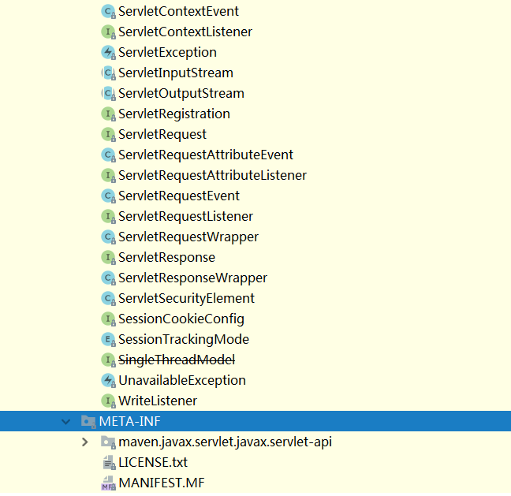
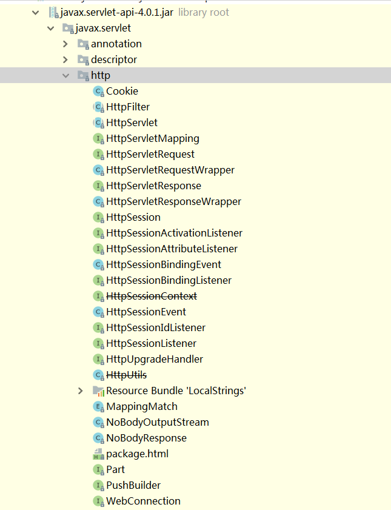

# Servlet-Study
    Servlet执行流程，生命周期，获取数据，get，post，和客户端交互等
 
### 1. 包结构



http子包机构


<hr>

### 2. Servlet接口
javax.servlet.Servlet是一个接口
```java
package javax.servlet;

import java.io.IOException;

public interface Servlet {
    void init(ServletConfig var1) throws ServletException;

    ServletConfig getServletConfig();

    void service(ServletRequest var1, ServletResponse var2) throws ServletException, IOException;

    String getServletInfo();

    void destroy();
}
```
>ServletConfig是一个配置文件，可供Servlet初始化。
>此外重要的是Service方法，也就是这个Servlet的业务。

<hr>

### 3. HttpServlet抽象类
```java
public abstract class HttpServlet extends GenericServlet {
     protected void doGet(HttpServletRequest req, HttpServletResponse resp) throws ServletException, IOException {
         String protocol = req.getProtocol();
         String msg = lStrings.getString("http.method_get_not_supported");
         if (protocol.endsWith("1.1")) {
             resp.sendError(405, msg);
         } else {
             resp.sendError(400, msg);
         }
     } 
     
     protected void doPost(HttpServletRequest req, HttpServletResponse resp) throws ServerException, IOException {
         ...
     }
     
     protected void doHead(...) { ... }
     
     protected void doPut(...) { ... }
     
     protected void doDelete(...) { ... }
     
     protected void service(HttpServletRequest req, HttpServletResponse resp) throws ServletException, IOException {
         String method = req.getMethod();
         long lastModified;
         if (method.equals("GET")) {
             lastModified = this.getLastModified(req);
             if (lastModified == -1L) {
                 this.doGet(req, resp);
             } else {
                 long ifModifiedSince = req.getDateHeader("If-Modified-Since");
                 if (ifModifiedSince < lastModified) {
                     this.maybeSetLastModified(resp, lastModified);
                     this.doGet(req, resp);
                 } else {
                     resp.setStatus(304);
                 }
             }
         } else if (method.equals("HEAD")) {
             lastModified = this.getLastModified(req);
             this.maybeSetLastModified(resp, lastModified);
             this.doHead(req, resp);
         } else if (method.equals("POST")) {
             this.doPost(req, resp);
         } else if (method.equals("PUT")) {
             this.doPut(req, resp);
         } else if (method.equals("DELETE")) {
             this.doDelete(req, resp);
         } else if (method.equals("OPTIONS")) {
             this.doOptions(req, resp);
         } else if (method.equals("TRACE")) {
             this.doTrace(req, resp);
         } else {
             String errMsg = lStrings.getString("http.method_not_implemented");
             Object[] errArgs = new Object[]{method};
             errMsg = MessageFormat.format(errMsg, errArgs);
             resp.sendError(501, errMsg);
         }
     }
     
     ...
}
```
>可以看出，HttpServlet是一个类，而且其是直接继承javax.servlet.GenericServlet抽象类。
>这个GenericServlet是Servlet的基类。它实现了javax.servlet.Servlet接口和javax.servlet.ServletConfig以及序列化接口。如下
```java
public abstract class GenericServlet implements Servlet, ServletConfig, Serializable {
    ...
}
```
>doPost、doGet等请求处理方法是HttpServlet抽象类特有的，其以上的父类和父类实现的接口都没有。

<hr>

### 4. HttpFilter抽象类
HttpFilter过滤器的定义结构和HttpServlet类似。其也是一个抽象类。直接继承javax.servlet.GenericFilter过滤器的基类。
```java
package javax.servlet.http;

import java.io.IOException;
import javax.servlet.FilterChain;
import javax.servlet.GenericFilter;
import javax.servlet.ServletException;
import javax.servlet.ServletRequest;
import javax.servlet.ServletResponse;

public abstract class HttpFilter extends GenericFilter {
    public HttpFilter() {
    }

    public void doFilter(ServletRequest req, ServletResponse res, FilterChain chain) throws IOException, ServletException {
        if (req instanceof HttpServletRequest && res instanceof HttpServletResponse) {
            this.doFilter((HttpServletRequest)req, (HttpServletResponse)res, chain);
        } else {
            throw new ServletException("non-HTTP request or response");
        }
    }

    protected void doFilter(HttpServletRequest req, HttpServletResponse res, FilterChain chain) throws IOException, ServletException {
        chain.doFilter(req, res);
    }
}
```
这是javax.servlet.GenericFilter基类的定义，实现了三个接口
```java
public abstract class GenericFilter implements Filter, FilterConfig, Serializable {
    ...
}
```
而起特有的javax.servlet.FilterChain过滤链就是一个接口而已，如下
```java
package javax.servlet;

import java.io.IOException;

public interface FilterChain {
    void doFilter(ServletRequest var1, ServletResponse var2) throws IOException, ServletException;
}
```
>FilterChain 接口的 doFilter 方法用于通知 Web 容器把请求交给 Filter 链中的下一个 Filter 去处理，
如果当前调用此方法的 Filter 对象是Filter 链中的最后一个 Filter，那么将把请求交给目标 Servlet 程序去处理。

### 5. HttpSession、HttpServletRequest、HttpServletResponse接口
    这些都是接口而不是类。
1. 就Session而言，只有javax.servlet.http.HttpSession这个，这个接口什么都没继承。也不存在javax.servlet.Session这种接口。
2. HttpServletRequest和HttpServletResponse分别是一个继承ServletRequest和ServletResponse的接口。